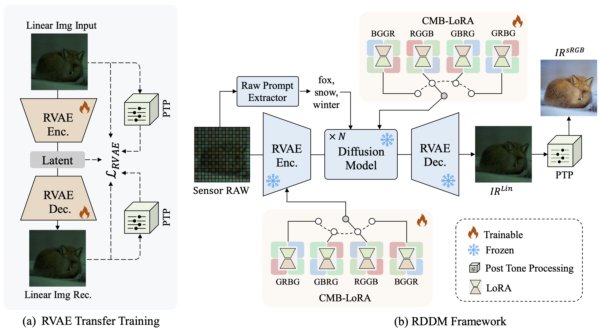
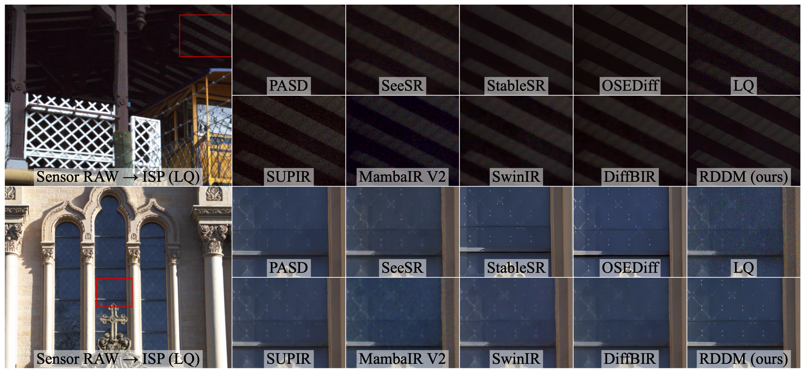
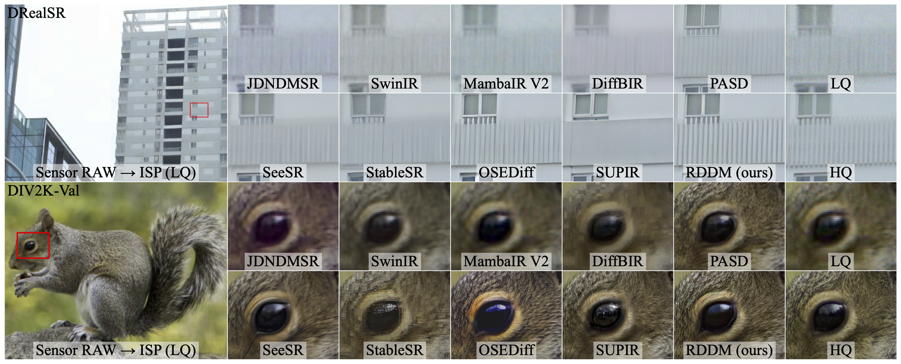
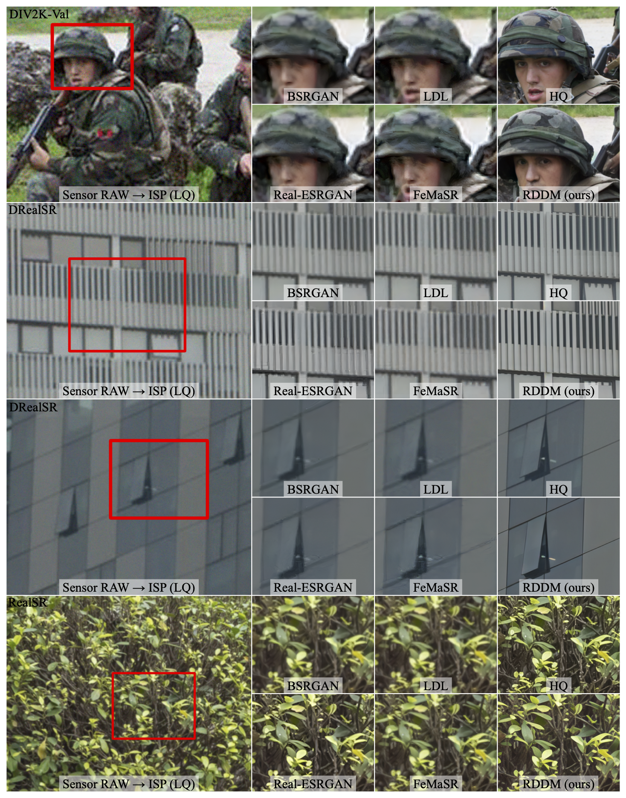
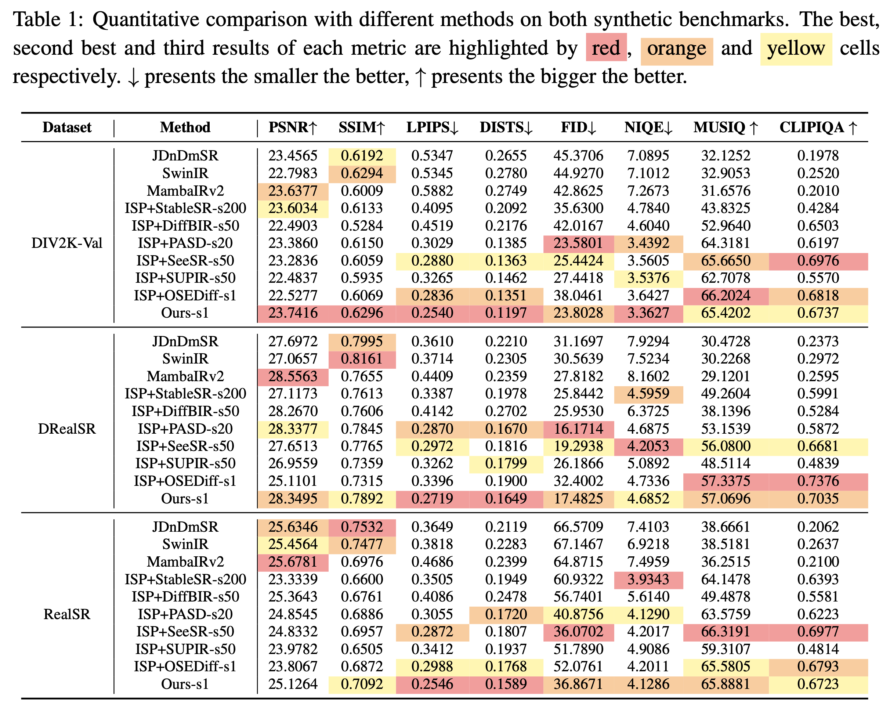

# RDDM: Practicing RAW Domain Diffusion Model for Real-world Image Restoration
The official implementation  for "RDDM: Practicing RAW Domain Diffusion Model for Real-world Image Restoration"

  <a href="https://arxiv.org/pdf/2508.19154">
    
   </a>


> **RDDM: Practicing RAW Domain Diffusion Model for Real-world Image Restoration** <br>
<div>
    Yan Chen<sup>1,†</sup>&emsp;
    Yi Wen<sup>1†</sup>&emsp;
    Wei Li<sup>1</sup>&emsp;
    Junchao Liu<sup>1</sup>&emsp;
    Yong Guo<sup>2</sup>&emsp;
    Jie Hu<sup>1</sup>&emsp;
    Xinghao Chen<sup>1</sup>&emsp;
</div>

<div>
    <sup>1</sup>Huawei Noah’s Ark Lab, <sup>2</sup>Max Planck Institute for Informatics <br/>
</div>

---

> **Abstract:**
We present the RAW domain diffusion model (RDDM), an end-to-end diffusion model that restores photo-realistic images directly from the sensor RAW data. While recent sRGB-domain diffusion methods achieve impressive results, they are caught in a dilemma between high fidelity and realistic generation. As these models process lossy sRGB inputs and neglect the accessibility of the sensor RAW images in many scenarios, e.g., in image and video capturing in edge devices, re- sulting in sub-optimal performance. RDDM obviates this limitation by directly restoring images in the RAW domain, replacing the conventional two-stage im- age signal processing (ISP)→Image Restoration (IR) pipeline. However, a simple adaptation of pre-trained diffusion models to the RAW domain confronts the out- of-distribution (OOD) issues. To this end, we propose: (1) a RAW-domain VAE (RVAE), encoding sensor RAW and decoding it into an enhanced linear domain image, (2) a configurable multi-bayer (CMB) LoRA module, adapting diverse RAW Bayer patterns such as RGGB, BGGR, etc. To compensate for the defi- ciency in the dataset, we develop a scalable data synthesis pipeline synthesizing RAW LQ-HQ pairs from existing sRGB datasets for large-scale training. Ex- tensive experiments demonstrate RDDM’s superiority over state-of-the-art sRGB diffusion methods, yielding higher fidelity results with fewer artifacts.


## News
- [2025.11] This repo is created.

## Dependencies & Installation
Please refer to the following simple steps for installation.
```
git clone https://github.com/YanCHEN-fr/RDDM.git
cd RDDM
conda create -n RDDM python=3.10 -y
conda activate RDDM
pip install -r requirements.txt
```

## Datasets

## Training
```
cd RDDM
bash train.sh
```

## Test
```
bash test.sh
```

## Results

### Qualitative Comparisons on real RAW dataset (DND)


### Qualitative Comparisons with diffusion-based methods


### Qualitative Comparisons with GAN-based methods


### Quantitative Comparisons



## Acknowledgement

This work is released under the Apache 2.0 license.
 The codes are based on [OSEDiff](https://github.com/cswry/OSEDiff), [Unprocess](https://github.com/timothybrooks/unprocessing) Please also follow their licenses. Thanks for their awesome works.
